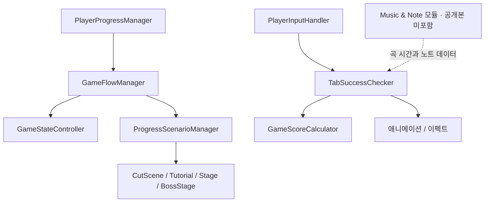

# Groove Warrior

Unity / C#으로 개발한 리듬 액션 게임의 **Frontend 코드 포트폴리오**입니다. 게임 진행과 상태 전환, 리듬 입력 판정, 점수·이펙트, 컷씬 편집 및 실행 코드를 정리했습니다.

## 프로젝트 개요

| 항목 | 내용 |
| --- | --- |
| 개발 기간 | 2026.07.13 ~ 2026.07.27 |
| 개발 인원 | 3인 |
| Frontend | 양원준 |
| Music & Note | 김기현 |
| Art | 김석하 |
| 원본 Unity Editor | 6000.3.9f1 |

기간·인원·역할은 프로젝트 기술문서의 정보를 기준으로 합니다. 공개 소스는 현재 로컬 프로젝트의 스냅샷이며 개발 기간 종료 당시의 버전을 의미하지 않습니다.

## 주요 구현과 코드 탐색

| 영역 | 구현 | 시작점 |
| --- | --- | --- |
| 게임 흐름 | 진행도에 맞는 콘텐츠 실행, 완료·실패 처리 | [GameFlowManager](Assets/02_Scripts/01_YWJ/GameFlowScript/GameFlowManager.cs) |
| 게임 상태 | 모드별 상태 전환과 UI 연동 | [GameStateController](Assets/02_Scripts/01_YWJ/GameStateScripts/GameStateController.cs) |
| 진행도 | JSON 기반 진행 저장과 변경 이벤트 | [PlayerProgressManager](Assets/02_Scripts/01_YWJ/PlayerScripts/Progress/PlayerProgressManager.cs) |
| 리듬 입력 | Input System 콜백을 판정 로직으로 전달 | [PlayerInputHandler](Assets/02_Scripts/01_YWJ/PlayerScripts/PlayerInputHandler.cs) |
| 리듬 판정 | TAP·HOLD 판정, 노트 상태와 재시작 경계 처리 | [TabSuccessChecker](Assets/02_Scripts/01_YWJ/GameLogicScripts/TabSuccessChecker.cs) |
| 점수 | 성공·실패 이벤트에 따른 콤보와 점수 계산 | [GameScoreCalculator](Assets/02_Scripts/01_YWJ/GameLogicScripts/GameScoreCalculator.cs) |
| 이펙트 | ID별 Queue 기반 인스턴스 대여·반환 | [AttackEffectPoolManager](Assets/02_Scripts/01_YWJ/GameLogicScripts/TabFXScripts/AttackEffect/AttackEffectPoolManager.cs) |
| 컷씬 실행 | Step 순차 실행, Action 동시 실행과 선택적 완료 대기 | [CutSceneManager](Assets/06_CustomEditor/YWJ_CutSceneEditor/Runtime/CutSceneManager.cs) |
| 컷씬 편집 | Step·Action 편집, 씬 대상 선택, 플레이 모드 테스트 | [CutSceneEditorWindow](Assets/06_CustomEditor/YWJ_CutSceneEditor/Editor/CutSceneEditorWindow.cs) |

## 공개 범위

- `Assets/02_Scripts/01_YWJ`: Frontend 게임플레이 코드
- `Assets/06_CustomEditor/YWJ_CutSceneEditor`: 컷씬 편집기와 런타임
- C# 파일 72개 및 관련 파일·폴더 `.meta`
- [구조 설명](docs/ARCHITECTURE.md), [의존성과 검증 범위](docs/DEPENDENCIES.md)

Music & Note 담당의 `KKH` 모듈, 외부 에셋 코드, 이미지·음원·모델, 씬·프리팹·ScriptableObject 인스턴스와 프로젝트 설정은 포함하지 않습니다. 팀 전체 작업을 개인 구현으로 표시하지 않으며, 문서에서 모듈 간 연동을 구분합니다.

**코드 열람용 저장소로, 단독으로 Unity 컴파일 또는 게임 실행이 가능한 프로젝트가 아닙니다.** 실행하려면 제외된 모듈과 에셋, 패키지 및 Inspector 연결이 필요합니다. Unity 실행·빌드·플레이 테스트는 수행하지 않았습니다.

원본 소스와 `.meta`의 바이트를 보존했습니다. 일부 원본 C#은 CP949 인코딩이므로 한글이 깨져 보이면 편집기에서 해당 인코딩으로 다시 열어 주세요. MIT 등 별도의 재사용 라이선스는 부여하지 않았습니다.
